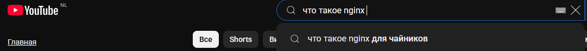
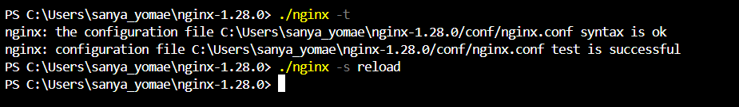
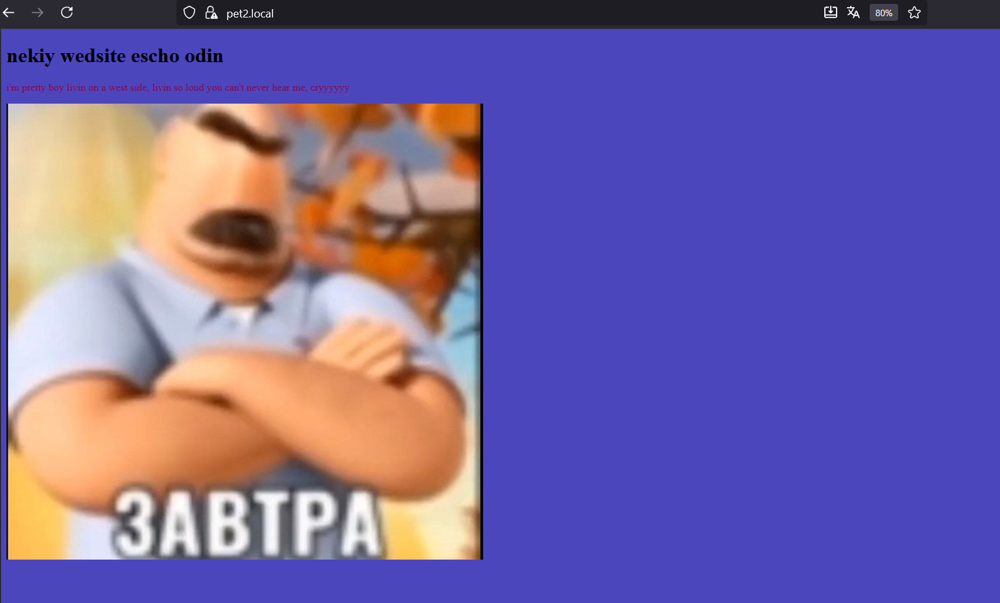
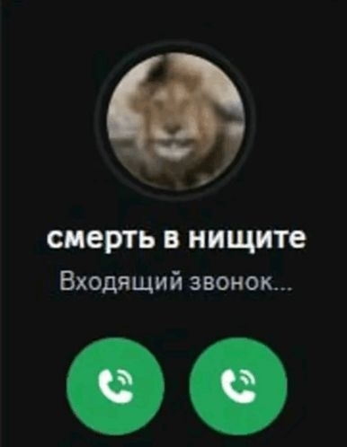
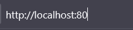
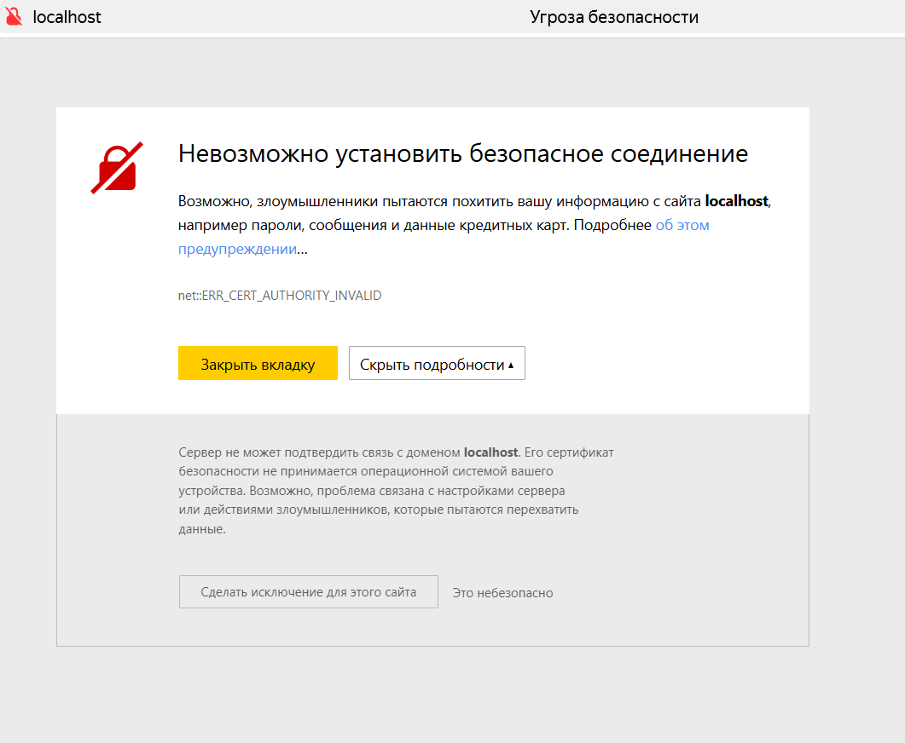

# ОТЧЕТ
## Начало
#### С первого прочтения задания было не ясно, что вообще нужно от меня. Сайты для меня были просто чем-то, что работает и кайф, а если долго грузит: блин емае че такое давай быстрей и тд...
  


#### Сразу бежать в гпт или подобные ИИшки не хотелось, имелось желание самому попытаться найти информацию и что-то попытаться сделать. Поэтому я **сам** перешел по ссылке в лабе(ничего особо не нашел) и **сам** забил в ютуб "nginx что такое, что делать".
  
  
  
#### Тут-то получилось найти хорошее видео. Естественно надо было скачать nginx с офик сайта. По совету из видео удалил все из файла .conf и создал простой html файлик, который в последствии перерос в pet_p_1. Однако после всех объяснений и инструкций не все работало, к сожалению. Проверял и перезагружал, но ниче не работало.
  


#### Пришлось обратиться в "глубокий поиск" и магическим образом сначала оказалось, что у меня не правильный путь в location:
```python
  root html;
  index pet_p_1.html;
```  
#### а нужно было 
```python
  root .../html;
  index pet_p_1.html;
```
#### Так еще и это не работало, потому что **C:/Users/Саня/**, а как сделал уже **C:/Users/sanya_yomae/** все заработало
  


## Не начало, но и не конец
Создал второй файл pet_p_2.html, закинул в .conf и проверил работоспособность.
  


### Летим дальше
#### делаем переадресацию
```python
    server {
        listen 80;
        server_name localhost;

        location / {
            return 301 https://pet1.local$request_uri;
        }
    }
```  


#### меняем порты для петпроектов и сталкиваемся с проблемкой, что не работает так, низя :(
```python
    server {
        listen       443 ssl;
        server_name  pet1.local;
...
    server{
        listen       443 ssl;
        server_name  pet2.local;
```


#### пришлось думать и узнавать. Оказывается что нужно кое-что добавить в C:/Windows/.../hosts
```python
127.0.0.1 pet1.local
127.0.0.1 pet2.local
```


#### Далее по заданию создаем сертификаты, самоподписанные, потому что я студент и у меня нет денег :skull: ...
  


#### Для создания нужен OpenSSL, скачиваем сначала, далее создаем ключик и сертификат для обоих проектов вот такими командами:
##### (да на 10 лет, а что :see_no_evil:)
```python
openssl req -x509 -nodes -days 3650 -newkey rsa:2048 -keyout pet_p1.key -out pet_p1.crt -subj "/CN=pet1.local"
...
openssl req -x509 -nodes -days 3650 -newkey rsa:2048 -keyout pet_p2.key -out pet_p2.crt -subj "/CN=pet2.local"
```


## Летс гоу проверять!!!

### Первый
#### Проверяем первый
  


  


#### Сначала не совсем хоба, так как сертификаты подписанны не официальными всемирно признанными компаниями, а лично мной, а значит это не безопасно. Браузер естественно жалуется, но дает доступ с предупреждением так и так, опасность. Мы все понимаем и принимаем, я же не буду сам себя обманывать. 
 


#### Принимаем все условия и все работает!!!!!!!!!!!!!!!!! Ура


  


### Второй
#### Проверяем второй
  


  
