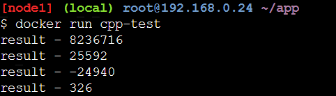
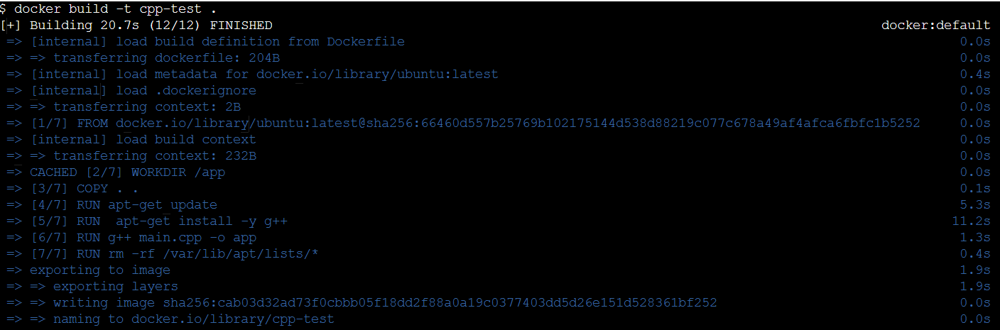
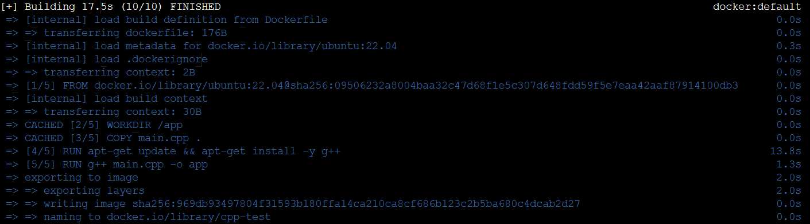

# Отчет

## Что такое Docker :raised_eyebrow: :thinking:

Про докер до этой лабы я ничего не знал, и в основном слышал либо в рекламах на ютубе, либо в тик-токе на записи собесов. Сначала я решительно зашел в ютуб


Там я нашел много видосов и часть из них были реально хорошими, там же ссылку на хабр (вроде полезную). Вот **https://habr.com/ru/companies/kokocgroup/articles/802039/**.

Чтоб все закрепить закинул запрос в гпт и прочитал там все то же самое, что слышал в других источниках и приступил к работе.

## Работа

Сначала написал маленький код в файл main.cpp который буду использовать в image докерфайла.
```
#include <iostream>
#include <vector>

int main() {

    int a = 326;
    int b = 25266;
    std::vector<int> arr;

    arr.push_back(a * b);
    arr.push_back(a + b);
    arr.push_back(a - b);
    arr.push_back(a);

    for (int i = 0; i < 4; ++i) {
        std::cout << "result - " << arr[i] << '\n';
    }
    
    return 0;
}
```

Я решил сначала просто написать докерфайл, а потом поискать какие-нибудь примеры хороших файлов и с помощью этого либо найти ошибки у себя либо специально их сделать.

~~только преподавателю не говорите😉:~~


Вот такой получился у меня докерфайл
```
FROM ubuntu:latest
WORKDIR /app
COPY main.cpp .
RUN apt-get update && apt-get install g++ 
RUN g++ main.cpp -o app
ENTRYPOINT ["./app"]
```

Я хотел изначально установить Docker desktop, но раз десять не получалось и все это шло ооооооочень медленно. Поэтому я использовал сайт play with docker.
Там ввел такие команды:
```
mkdir app
cd app
nano main.cpp
nano Dockerfile
docker build -t cpp-test .
docker run cpp-test
```
После чего получил вот это:



Далее я начал искать примеры хороших докер файлов. Проанализировал свой файл и вот какие два файла сделал в итоге. 
### ПЛОХОЙ
```
FROM ubuntu:latest
WORKDIR /app
COPY . .

RUN apt-get update
RUN apt-get install -y g++
RUN g++ main.cpp -o app
RUN rm -rf /var/lib/apt/lists/*

ENTRYPOINT ["./app"]
```
### ХОРОШИЙ
```
FROM ubuntu:22.04
WORKDIR /app
COPY main.cpp .

RUN apt-get update && apt-get install g++ 
RUN g++ main.cpp -o app

ENTRYPOINT ["./app"]
```

Теперь сравним.

**Первое:**
Я в своем файле использовал FROM ubuntu:latest, что не очень хорошо, в нормальных файлах всегда указывается определенная версия, потому что последние могут иметь баги и вообще обновляться когда угодно, что может повлиять на работоспособноть и качество. В хорошем файле я это исправил.

**Второе:**
Я в своем файле не допустил этого, но добавил в плохой, это COPY . ., данная команда копирует ненужные файлы, из-за чего увеличивается размер образа, сам докерфайл сработает(я покажу на примере позже), но будет много весить. В хорошем файле данная практика была исправлена и мы копируем только то, что нужно для работы.

**Третье:**
В плохом файле много RUN, что добавляет дополнительные ненужные слои, которые нагружают образ. В своем файле я этого избежал и в хорошем файле также это было учтено и исправлено.


### Теперь покажу что оба файла работают
**ПЛОХОЙ**



**ХОРОШИЙ**



Хороший файл в итоге весил меньше и собрался быстрее.

А теперь без прилюдий, плохиие практики в работе с контейнерами. 🇦🇨 🎱

**Первая**
Очень неприятно, когда пользовался пользовался контейнером, а при последующем запуске все данные не сохранились, потому что изначально они были изнутри. Например, если это база данных, ее просто не будет после перезапуска. Решается всё просто — нужно использовать volume, то есть хранить данные снаружи контейнера.
```
docker run -d --name mydb mysql - вот это бяка

docker run -d --name mydb -v mydata:/var/lib/mysql mysql - это не бяка
```

**Вторая**
Я запускал докерфайл без ограничений в памяти, а вдруг у нас тяжелые контейнеры и если их запускать, то они начнут драться за память, что грустно.
```
docker run -d myapp -> :(

docker run -d --memory="512m" --cpus="1" myapp -> :)
```


